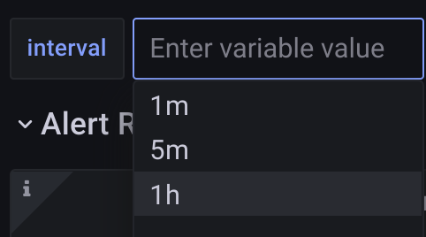

# Metrics Training

[tl-eirik-albrigtsen/metrics](https://tl-eirik-albrigtsen.github.io/metrics)

<aside class="notes">

- welcome to the 2h block booking on metrics
- pretty broad list of topics we are going to cover
- and we are going to dig into stuff deeply on some of the ends (depending on what i think is useful / what we have gotten questions for)
- ultimately; this stuff requires a bit of trial and error hope is that by learning about these concepts that you at least know what is possible and can figure it out from there
- recording, watch later etc, and feel free to drop whenever - voluntary stuff - don't stay here if it's not useful - like 80 people signed up!?
- url has slides with links, follow along there
 along

</aside>

--

### Agenda

- metrics overview & types
- metric questions & querying
- qa + break
- optimization
- visualisation
- fix a dashboard demo

<aside class="notes">

- metric types/overview first, what they are, what they look like, and using the base types
- initial bits maybe trivial if you have played around with this a lot already, but then it should get more interesting after that
- then questions you can answer with metrics, and more complex querying from the metrics we have
- 5m/10m q/a + 5/10min break
- optimizing queries with 3 strategies
- visualisation :: tons of tips and tricks in there - some of which i think are going to be mandatory to actual have legible panels

</aside>

<!-- chapter 1 -->

---

### What are metrics

<ul>
<li>collections of data points</li>
<li class="fragment">data points exposed by an app</li>
<li class="fragment">exposed on /metrics as text</li>
<li class="fragment">fetched by prometheus</li>
<li class="fragment">prometheus /15s :: GET /metrics</li>
</ul>

<aside class="notes">

- metrics are a collection of data points
- data points are snapshots of state exposed by the service
- you expose it on /metrics, and something will continually pull that state
- that something is called prometheus, it does the snapshotting.

</aside>

--

### What metrics looks like

```yaml
# TYPE http_requests_in_flight gauge
http_requests_in_flight 13
# TYPE http_request_seconds summary
http_request_seconds_sum{method="GET"} 9036.32
http_request_seconds_count{method="GET"} 807283.0
http_request_seconds_created{method="GET"} 1605281325.0
http_request_seconds_sum{method="POST"} 479.3
http_request_seconds_count{method="POST"} 34.0
http_request_seconds_created{method="POST"} 1605281325.0
# TYPE process_cpu_seconds counter
# UNIT process_cpu_seconds seconds
process_cpu_seconds_total 4.20072246e+06
```

<aside class="notes">

- plain text that your app exposes, two text formats, prometheus and openmetrics - but virtually identical (we use the old, and will move to the new one as we go along)
- new format has UNIT instructions in the text
- depending on language also possible to expose this via grpc, but diminishing returns to optimize, you get 4-8requests pre minute typically

</aside>

--

### Metric terminology

```yaml
# TYPE http_requests_in_flight gauge
http_requests_in_flight 13
# TYPE http_request_seconds summary
http_request_seconds_sum{method="GET"} 9036.32
http_request_seconds_count{method="GET"} 807283.0
http_request_seconds_created{method="GET"} 1605281325.0
http_request_seconds_sum{method="POST"} 479.3
http_request_seconds_count{method="POST"} 34.0
http_request_seconds_created{method="POST"} 1605281325.0
# TYPE process_cpu_seconds counter
# UNIT process_cpu_seconds seconds
process_cpu_seconds_total 4.20072246e+06
```

<aside class="notes">

- the name on the left in green is the metric, the braces are label selectors, the white text is the value of the metric at that label point
- if a metric has labels, then the metric has more than one dimension, in flight + process cpu has dimension 1, but the middle ones have two variant, a method dimension if you will

</aside>

---

### Metric Types

<ul>
<li class="fragment"><b>Gauge</b> - numerical value (can change)</li>
<li class="fragment"><b>Counter</b> - monotonically increasing number</li>
<li class="fragment"><b>Histogram</b> - counter with bucket dimensions</li>
</ul>

<aside class="notes">

- we will do a little practical work here, show how all the metric types behave, and how to query them.
- gauges are nice to plot by themselves no need for rates
- counters easy to work with for app people, just call increment. monotonically increasing. prom tracks increases.
- histogram - you can group, i.e. response times into buckets for classification

</aside>

---

### Gauges


<aside class="notes">

- gauges - shown 3 here - see all of fluctuate
- gauges can be dimensional, as you can see, here we have selected away one dimension, only focusing on the mutating ones, and we still get one metric per apiserver instance on kubernetes masters
- gauges can be awkward to work with in an app as app often needs to compute global state to set them (arch concern)
- and also coz prometheus polls every 15s, so you will not be able to infer num requests or anything (spikes) - might large values
- the best you can answer with this metric here is: on average how many requests are in flight (hope stats avg out)

</aside>

--

### Gauges Sum


<aside class="notes">

- if you have multiple gauges - that represent the same thing, you often just sum them together
- did you know that even dev cluster, the api server on avg has 4-5 mutating calls ongoing to kubernetes state?
- no code freeze within kubernetes
- counters, super easy to visualize, just select the right element(s)

</aside>


---

### Counters


<small class="fragment">9 hour interval :: 0 -> ~55000</small>
<aside class="notes">

<aside class="notes">

- counters. easier for app: only call counter.increment
- so by definition, monotonically increasing (hence increasing lines)
- pods rotate, i.e. spot node goes down, or app crashes, then counter resets happen (start 0)
- here is a metric from the kubelet, how many cpu seconds a named pod is using
- from 19:00 to 04:00 this pod went, on a fresh-pod, from using 0 cpu seconds (at boot), to ~ 55k
- counter queries always rooted in a time delta => interested in the rate of change of these graphs

</aside>

--

### Counters Rate


<small class="fragment">500 * 12 * 9 = 54000</small>
<aside class="notes">


- we wrap a rate or an increase around it to see the rate of change over a time interval
- here 5m => on average, pod is using 500 cpu seconds every 5m
- there are 12 x 5 minute intervals in an hour - math works out on red line cross ref
- (this intuition only works with increase not rate - cover this here)

</aside>

--

### Counters Sum Rate


<aside class="notes">

- finally, because the lines are never overlapping (always only one -0 suffixed pod), we sum to reduce the dimensionality and get one generally continuous line
- however, small point, see that the rate has now doubled when taking the sum?
- care to guess why that is?

</aside>

--

### Counters Correct Sum Rate


<aside class="notes">

- containes cpu usage seconds metric actually exposes subtly different values
- one is the total for the pod, other is prometheus (main container)
- go back show hard to miss lines, and sidecars at bottom
- pick container you want in query
- moral of the story is that your intuition w.r.t. SHOULD make sense when constructing queries

</aside>

---

### Histograms

- casual: "counter with a bucket dimension"
- really: `$name_{sum,bucket,count}`
- [prometheus histograms](https://prometheus.io/docs/practices/histograms/)


<aside class="notes">

- a histogram is a multi-dimensional counter that has a bucket dimension
- the bucket is typically named le (less than or equal - see pic)
- name is technically the thing without the _bucket, because a histogram comes with a few auxillary metrics like `_sum` (sum of all the values) and `_count` a superfluous the count way to reference the less than infinity bucket
- as a user, you just register the histogram in the app with buckets, and then just call how long it took / how big what your measuring is, and the metric lib puts it in the bucket, and also creates these 3 metrics
- if 0.39 put in all > 0.4 and +Inf

</aside>

--

### Histograms Quantiles


<aside class="notes">

- 95% quantile, is the point where 95% of the data has values less than this number
- the most common thing to use with histograms, because it more accurately captures tail latencies than averages
- AUTOCOMP: in prometheus interface, type 0.95, tab, paste metric name (also in grafana, even better, detects)
- 95% of client reqests in payments api took less than around 3s - with around 1s variance
- there are other ways to use histograms, but this is the most common one - will show one more later
- TODO: q/a now?

</aside>

<!--
- TODO: own slide? what is this for? generally, quantile estimation. and depending on usage, it sometimes makes sense to compute quantiles in the app, but histograms is the easier, less-error prone alternative
- BEST ESTIMATE, BUCKET DEPENDENT (threshold? somewhere between, avg is best guess)

-->

<!-- chapter 2 -->

---

### What are metrics for

WTF questions
<ul>
<li class="fragment">is my app slower after upgrade?</li>
<li class="fragment">is it using more resources now?</li>
<li class="fragment">is it taking longer to respond to request than usual?</li>
<li class="fragment">what's going on with the tail latencies?</li>
<li class="fragment">what went wrong?</li>
</ul>

<aside class="notes">

- metrics fundamentally here to answer questions like WTF is going on with your service
- is it slower now than before? using more resources?
- it's not necessarily enough to figure out WHY something is wrong, but points you at the right direction
- and in the case of an incidents, breached acceptable thresholds on metrics is usually what starts an incident (then you can go look at logs, traces etc to figure out why and where)

</aside>

---

### Questions solvable by metrics
<ol>
<li class="fragment">state + trends of kubernetes objects</li>
<li class="fragment">resource usage of kubernetes objects</li>
<li class="fragment">capacity planning via on resource usage</li>
<li class="fragment">state + trends of your custom metrics</li>
<li class="fragment">SLOs + error budgets + burndown</li>
</ol>

<aside class="notes">

- trends of some inherent property of the objs (pods alive, deployments ready)
- but also trends on resource usage
- and you can use these resource usage metrics proactively to project when you are going to run out.
- but importantly though; you can expose your own business metrics
- and these are typically what is used in more complex things like request availability, failure rates, which gets further defined in SLOs (we'll hit on this again later)

</aside>

---

### Kubernetes object metrics

- [is my `Cronjob` running](https://prometheus-underlying.truelayer.com/graph?g0.expr=sum(kube_cronjob_status_active%7Bcronjob%3D%22security-checks-host-vulnerabilities%22%7D)&g0.tab=0&g0.stacked=0&g0.show_exemplars=0&g0.range_input=6h)?
- [how does my `HPA` actually scale](https://grafana.t7r.dev/d/alJY6yWZz/kubernetes-horizontal-pod-autoscaler)?
- [is my `Pod` been crashlooping](https://prometheus-underlying.truelayer.com/graph?g0.expr=increase(kube_pod_container_status_restarts_total%7Bjob%3D%22kube-state-metrics%22%2C%20namespace%3D~%22.*%22%7D%5B10m%5D)%20%3E%200%0Aand%0Akube_pod_container_status_waiting%7Bjob%3D%22kube-state-metrics%22%2C%20namespace%3D~%22.*%22%7D%20%3D%3D%201&g0.tab=0&g0.stacked=0&g0.show_exemplars=0&g0.range_input=6h)?

<p class="fragment">beats: kubectl get X -oyaml</p>

<aside class="notes">

- snapshots of kubernetes state - via kube-state-metrics
- DEPLOY: enough replicas? mismatches beween desired/actual? (spec/status)
- HPA: how does hpa driven replica count cycle over time
- POD: if you paid attention last week during dns issues - you likely saw these
- All in theory reproducible locally, if you hit up enter every 15s

</aside>

--

### Resource usage of k8s objects

- [how much memory/cpu/disk used by pods](https://grafana.t7r.dev/d/6581e46e4e5c7ba40a07646395ef7b23/kubernetes-compute-resources-pod)
- [how much IO used by pods](https://grafana.t7r.dev/d/7a18067ce943a40ae25454675c19ff5c/kubernetes-networking-pod)
- compare: resource vs. requests/limits

<aside class="notes">

- via kubelet state (how much memory cpu your pods use)
- IO: (iops, watches, bandwidth/packets rx/tx/dropped - node-exporter)
- compare: kube-state vs. kubelet metrics

</aside>

--

### Resource usage of aggregated k8s

- [mem/cpu/disk](https://grafana.t7r.dev/d/a164a7f0339f99e89cea5cb47e9be617/kubernetes-compute-resources-workload)/[IO](https://grafana.t7r.dev/d/728bf77cc1166d2f3133bf25846876cc/kubernetes-networking-workload) usage for a deployment
- [..utilization on a node](https://grafana.t7r.dev/d/200ac8fdbfbb74b39aff88118e4d1c2c/kubernetes-compute-resources-node-pods)
- [..utilization on a cluster](https://grafana.t7r.dev/?orgId=1&search=open&query=cluster)

<aside class="notes">

- can use these same metrics and aggregate across various kubernetes types
- workloads(deployments - the ones you care about)
- nodes (saturation of owning node)
- clusters (need more nodes? devops metric)

</aside>

--

#### Kubernetes object metrics?

<i>What do you investigate with kubectl?</i>

→ [prometheus dev](https://prometheus-underlying.truelayer.com/graph) → kube_

<aside class="notes">

- GOTO dev prometheus, type `kube_` select kube object type, see what's available
- take 5 min, answer questions as best as possible

</aside>

--


### Trends on your custom metrics

TODO: better stuff here.. link up with SLO stuff

```yaml
# METRICS
http_server_sli_total{sli_error_type=~".+"}
pagerduty_routing_outcome_total{outcome="..."}
```

```css
sum(increase(alert_routing_outcome_total{}[$interval]))
by (outcome)
```

```css
sum(rate(alert_routing_outcome_total{outcome="success"}[1h]))
  /
sum(rate(alert_routing_outcome_total[1h]))
```

<aside class="notes">

- The most important category; 2 custom metrics that tracks standard SLI + a custom SLI (bottom)

</aside>


---

### SLOs

<ul>
<li class="fragment"><b>SLO</b>: Service Level Objective (the want)</li>
<li class="fragment"><b>SLI</b>: Service Level Indictor (the metric)</li>
<li class="fragment"><b>SLA</b>: Service Level Agreement (the contract)</li>
<li class="fragment"><b>Error Budget</b>: Allowed failure time</li>
</ul>

<aside class="notes">

- SLO: ..objective that we want to be successful (pod uptime, request availability, success rate)
- SLI: service level indicator - a metric that we can track over time to determine if app satisfing an objective
- SLA: a promise of maintaining an SLO for at least N% of the time monthly/yearly
- EB: complement of SLA over time period (e.g. 99.95% avail -> 4.38 hours per year, 43s/day)
- SRE book wisdom: track EB and slow down when you are using too much of it

</aside>

--

### SLOs TrueLayer

<ul>

<li class="fragment"><a href="https://paper.dropbox.com/doc/Availability-as-a-SLI--BDgeUkSCfcjodjnpn~LEMxg7Ag-AtRCn3Z6C7cRQ1v5bNmIa">Availability as SLI</a></li>
<li class="fragment"><a href="https://github.com/TrueLayer/truelayer-architecture/blob/main/adrs/0020-rest-api-metrics.md">ADR-20</a></li>
<li class="fragment"><a href="https://github.com/TrueLayer/truelayer-architecture/blob/main/adrs/0025-grpc-api-metrics.md">ADR-25</a></li>
<li class="fragment"><a href="https://grafana.truelayer.com/d/ASFR126Wd/rest-api-shared-metrics?orgId=1">Shared REST Metrics Dashboard</a></li>
<li class="fragment"><a href="https://github.com/slok/sloth">sloth</a></li>
</ul>

<small class="fragment"><a href="https://app.getguru.com/card/TdEodqxc/Tracking-SLOs-via-Honeycomb?q=slo">..via HoneyComb</a></small>

<aside class="notes">

- classified error types in 2020 (paper doc)
- made ADRs in 2021 - re-use of metric setups to allow dashboard reuse
- plumbing done, but still some edge cases
- TODO: verify clamp / absent
- TODO: verify space usage? why are they slow?
- TODO: show some big queries...
works for now, but imperfect. better to use honeycomb in the future

</aside>

---

### Advanced Query Functionality

- [querying functions](https://prometheus.io/docs/prometheus/latest/querying/functions/)
- [querying operators](https://prometheus.io/docs/prometheus/latest/querying/operators/)

<aside class="notes">

- best docs here are in these two docs has all the functionality
- will quickly blast through some things here

</aside>

--

### Query Functions

- rate/increase
- sum/max/min/topk :: by/without
- {aggregation}_over_time (avg, min, max, sum) <!-- count stddev> -->
- clamp_min + clamp_max = clamp
- predict_linear / deriv / delta
- math: sqrt, sgn, scalar, round, floor/ceil, logs, exp
- comparison: > < <= >= == !=
- absent

<aside class="notes">

- rate/increase - same except increase multiplies by time unit to get accurate wyw if value focus
- sums can be done with a (by) or (without) clause, to drop dimensionality
- sum drops ALL dimensions, sum by keeps 1, sum without drops only specifics
- avg_over_time, min_over_time - sometimes easier to read and make more sense MATH
- clamps are MIN, MAX fns
- TODO: advanced stuff, predict + absent
- comparisons: converts to bool stream: 0 or 1
- comparisons need to handle edge cases where stuff is absent

</aside>

--

### Query Operators 1 Logical

- [and (intersection)](https://prometheus-underlying.t7r.dev/graph?g0.expr=node_timex_offset_seconds%20%3E%200.0005%0A%20and%0Aderiv(node_timex_offset_seconds%5B5m%5D)%20%3E%200&g0.tab=1&g0.stacked=0&g0.show_exemplars=0&g0.range_input=1h&g1.expr=node_timex_offset_seconds%20%3E%200.0005&g1.tab=1&g1.stacked=0&g1.show_exemplars=0&g1.range_input=1h&g2.expr=deriv(node_timex_offset_seconds%5B5m%5D)%20%3E%200&g2.tab=1&g2.stacked=0&g2.show_exemplars=0&g2.range_input=1h) / or (union) / unless (complement)

<aside class="notes">

- did one AND before. container restarts, and between kube_pod_container_status_waiting and kube_pod_container_status_restarts changing
- way these works is that they match exact labels
- (set operation on label matches)

</aside>

--

### Query Operators 2 Joins

- [on](https://prometheus-underlying.t7r.dev/graph?g0.expr=(kube_job_failed%7Bjob%3D%22kube-state-metrics%22%2C%20namespace%3D~%22.%2B%22%7D%20%3D%3D%201)%20*%0Aon(job_name)%20group_left(label_app_kubernetes_io_name)%0Akube_job_labels%7Bjob%3D%22kube-state-metrics%22%2C%20label_app_kubernetes_io_name%3D~%22.%2B%22%7D%0A&g0.tab=1&g0.stacked=0&g0.show_exemplars=0&g0.range_input=1h&g1.expr=(kube_job_failed%7Bjob%3D%22kube-state-metrics%22%2C%20namespace%3D~%22.%2B%22%7D%20%3D%3D%201)&g1.tab=1&g1.stacked=0&g1.show_exemplars=0&g1.range_input=1h&g2.expr=kube_job_labels%7Bjob%3D%22kube-state-metrics%22%2C%20label_app_kubernetes_io_name%3D~%22.%2B%22%7D&g2.tab=1&g2.stacked=0&g2.show_exemplars=0&g2.range_input=1h) / ignoring

```promql
<vector expr> <bin-op> ignoring(<label list>) <vector expr>
<vector expr> <bin-op> on(<label list>) <vector expr>
```

<aside class="notes">

- these are hard AF. generally you are doing joins to get extra labels
- ex: LHS has root labels, group left (LEFT OUTER JOIN) on job_name
- and add label_app from that
- refine namespace to get less matches

</aside>

<!-- chapter 3 -->

---

### Optimizing Queries


<ul>
<li class="fragment">cardinality</li>
<li class="fragment">resolution</li>
<li class="fragment">recording</li>
</ul>


<aside class="notes">

- so you are here
- why would prometheus do this
- we will cover 3 optimization strategies
- cardinality: easiest to solve at design phase
- resolution: using less greedy queries
- recording rules: a hammer to help the hard cases

</aside>

---

### Cardinality
---


```yaml
http_request_sum{path="/api/v1",method="GET"} 9036.32
http_request_sum{path="/api/v2",method="GET"} 3036.1
http_request_sum{path="/api/v2",method="DELETE"} 1.3
http_request_sum{path="/api/v1",method="POST"} 4479.3
http_request_sum{path="/api/v2",method="POST"} 479.3
```

```py
cardinality(http_request_sum)
  = len({"GET", "POST", "DELETE"}) *
    len({"/api/v1", "/api/v2"})
  = 2*3 = 6
count(http_request_sum) = 5
```

<aside class="notes">

- card: modelling tool for metric size
- math way of measuring the cartesian products of set sizes (path dim x method dim = plane)
- discrete units, and small amounts of things on each axis so not a big plane
- but crucially the plane has more potential dots than what was exposed, count is 5, cardinality is 6
- card is the POTENTIAL that the metric can grow to with all its dimensions and is a MODELLING TOOL
- can model right and still make logic mistakes: include IDs, or allow arbitrary 404 urls => path can grow arbitrarily

</aside>

--

### Cardinality "Enrichment"

- `instance`/`pod` labels enriched
- highly parallel app => x100
- can elide, but hard

<aside class="notes">

- inconsistently adding either `instance`, `pod` or both in our scrapers
- some standardisation work remaining on this
- but ultimately, big highly parallel apps probably need to be conservative on estimates
- coz you might get 100x dimension added without you planning for it
- this is possible to elide, but requires a custom scraper, talk to us if this is something you need

</aside>

--

<!--
### Cardinality of Histograms

`http_request_duration_seconds_bucket`

<ul>
<li class="fragment"><b>le buckets</b> :: 41</li>
<li class="fragment"><b>service names</b> :: 33</li>
<li class="fragment"><b>app names</b> :: 28</li>
<li class="fragment"><b>status code</b> :: 20</li>
<li class="fragment"><b>action</b> :: 98</li>
<li class="fragment"><b>controller</b> :: 66</li>
</ul>

<strikeout class="fragment">uh... 41x33x28x20x98x66? ~= 5 billion..?</stikeout>
<p class="fragment">count(http_request_duration_seconds_bucket) = 100,000</p>


<aside class="notes">

- really hard to estimate, buckets are not standardised across apps
- so cardinalities are different for app subsets of each of them
- count by app, 2 apps account for 80k of that..
- super-metrics a bit of a double edged sword, useful for standardised panels, but makes it hard to see where the cardinality is coming from

</aside>

-->
#### Cardinality of Histograms

`http_request_duration_seconds_bucket`

<ul>
<li style="color: green"><b>100 instances with 10 buckets</b> :: 1,000 series</li>
<li class="fragment" style="color: green"><b>10 endpoints</b> :: 10,000 series</li>
<li class="fragment" style="color: yellow"><b>10 status codes</b> :: 100,000 series</li>
<li class="fragment" style="color: red"><b>4 http methods</b> :: 400,000 series</li>
<li class="fragment" style="color: red"><b>100 tenants</b> :: 40,000,000 series</li>
</ul>

<aside class="notes">

- advanced modelling: worst type case histogram calculation
- highly parallel app, 10 buckets (actually pretty good, 10 good number)
- 10 paths, perhaps a lot perhaps not
- 10 status codes... obviously not all codes will be avialable for all endpoints, but again modelling
- 4 methods
- and if someone comes along and wants a "helpful" tenant thing in there, then you have a beast of a time series that's probably going to cost you 100k$ yearly
- reference: we have <10M time series in prod (we do have several hundred k histograms)

</aside>

--

### Why care about cardinality

<ul>
<li>lower cardinality => faster response</li>
<li class="fragment">high cardinality => slow response / timeout</li>
<li class="fragment">limit labels to bounded sets</li>
<li class="fragment">drop labels on histogram</li>
<li class="fragment"><b>try to stay below 10k</b> per metric</li>
</ul>

<a class="fragment" href="https://promcon.io/2019-munich/slides/containing-your-cardinality.pdf">contain your cardinality</a>

<aside class="notes">

- prometheus has to fetch all the data you asked for and reduce it to fit one tiny line, bigger the data set the slower this is
- between 10k and 100k, it starts becoming awkward to do arbitrary queries on the data
- above 100k you have to start jumping through hoops to even get a response
- most of the time our prometheus is busy doing huge queries
- some of it comes with our scale, but some of it is definitely unavoidable

</aside>

--

#### Cardinality Optimization

<ul>
<li><b>100 pods with 10 buckets</b> :: 1k</li>
<li><b>10 endpoints</b> :: 10k</li>
<li><b>10 status codes</b> :: 100k</li>
<li><b>4 http methods</b> :: 400k</li>
<li><b>100 tenants</b> :: 40M</li>
</ul>

<small></small>

<ul class="fragment">
<li>m1_total : pods,ep,code = 10k</li>
<li>m2_bucket : pods,ep,buckets = 10k</li>
<li style="color:grey">m3_bucket : buckets*ep*method*code = 10k</li>
<li style="color:grey">m4_total : code,tenants = 1k</li>
</ul>

<aside class="notes">

- AFTER GOING THERE, COME BACK, WHY DOES THIS GIVE YOU THIS MANY?
- insane amount of data: lets you ask Q like: does this tenant have weird PUT behaviour on this POD?
- or what's my P85 on DEL requests receiving 200s?
- these might be questions you want to ask, but they are oddly specific INSTEAD
- do you just need to identify faulty endpoints/codes? m1!
- do you need to identify latencies for
- can you get away with just success rate per tenant? have a metric for that
- can you get away with buckets for just the endpoints? great.
- need buckets for all the static things, KIND OF, but you have to customize scraping for that
- are you just interested in the avg latency per tenant? KIND OF AGAIN, need to customize scraping
- generally we advise not including tenants and theoretically unbounded dimensions in metrics
- end sum: ~30k here can use multiple of these metric in one query to infer estimates of specific questions

</aside>

---

### Resolution

- 12d at 30s resolution is 1440 points
- 3d at 1m resolution is 4320 points
- 7d at 5m resolution is 2000 points
- 1 panel < 1000 pixels

<p class="fragment">resolution rule of thumb:</p>

<ul class="fragment">
<li>1m for < 3h</li>
<li>5m for < 12h</li>
<li>1h for > 12h</li>
</ul>

<aside class="notes">

- we all ask for too much data, but we can never use all of that data, not enough pixels
- a panel has 1000 pixels in general, maybe 2-3k on a 4k screen if you really blow one up, and you generally would not notice any behavioural difference if it had just 200-500 DP (trends > pixel accurate line)
- crucially tho: low res is much faster to retrieve, and high res is slow
- so set those intervals according to when you are browsing - here's a rule of thumb
- these resolutions not arbitrary; they correspond to how we store series in thanos long term (outside a couple of weeks, we only have 1h)
- but.. how do we make the interval dynamic? it's in the query...

</aside>

--

### Grafana Resolution Interval



<a class="fragment" href="https://grafana.t7r.dev/d/Ss1gJncnk/alert-routing?orgId=1&var-interval=1m&from=now-3h&to=now">play around</a>

<aside class="notes">

- have intervals parmaetrised in your dashboards - e.g. promload
- pass it as $interval in rates
- super helpful for intuition, use it all the time, also: increase vs rate
- also important to understand what happens when you change the interval?
- NB: graphs will often change quite drastically in response to it (higher time unit - smoother, looses fine detail - but nicer on the eyes)

</aside>

--

### Grafana Resolution


<aside class="notes">

- also whack the resolution to a half or a quarter, you're not going to notice a difference
- really hard to meaningfully distinguish between high res and low res - and the speed improvement is more important

</aside>

---

### Measure


<a class="fragment" href="https://prometheus-underlying.t7r.dev/graph?g0.expr=apiserver_request_duration_seconds_bucket&g0.tab=1&g0.stacked=0&g0.show_exemplars=0&g0.range_input=1h">play around</a>


<aside class="notes">

- prometheus will tell you if it's slow
- optimize, limit large fetches if you don't need it for your visualization
- note that mvp is usually fast - slower once there's more data, <.1s is good, <1s is OK

</aside>

---

### It's still slow? Recording rules

```yaml
apiVersion: monitoring.coreos.com/v1
kind: PrometheusRule
metadata:
  name: prometheus-stack-kube-prom-k8s.rules
spec:
  groups:
  - name: k8s.rules
    rules:
```

```yaml
- expr: |-
    sum by (cluster, namespace, pod, container) (
      irate(container_cpu_usage_seconds_total{
        job="kubelet",
        metrics_path="/metrics/cadvisor",
        image!=""}[5m]
      )
    ) * on (cluster, namespace, pod)
    group_left(node) topk by (cluster, namespace, pod) (
      1, max by(cluster, namespace, pod, node)
        (kube_pod_info{node!=""})
    )
  record: node_namespace_pod_container:container_cpu_usage_seconds_total:sum_irate
```

[usage](https://prometheus-underlying.t7r.dev/graph?g0.expr=node_namespace_pod_container%3Acontainer_cpu_usage_seconds_total%3Asum_irate%7Bnamespace%3D%22monitoring%22%2C%20pod%3D~%22.*prom-prometheus.*%22%7D&g0.tab=0&g0.stacked=0&g0.show_exemplars=0&g0.range_input=1h)

<aside class="notes">

- hammer that can fix things to factor out heavy queries tha twe need to do often
- need a costly query in an alert or a very common dashboard?
- write a record, and have the alert + dashboard re-use the record
- deindented here for clarity, enormous expression to calculate the cpu seconds
- deals with the pitfall i mentioned earlier, and you see it puts a record field
- convention is to use a consistent naming convention with categories separated by :
- here, node_level_resource colon metric_on_resourc colon how_it_is_measued
- so at least try to stick to a reasonable convention for it (examples in mixins)

</aside>

--

### Recording Rules Info

- provides a way to do costly steps
- evaluation cost amortised
- uses "sum() by" to reduce dimensions

<aside class="notes">

- prometheus is continually evaluating the expression so that you can get a fast result
- it is using dimensional reduction we talked about earlier
- leaving a dimensional series with substantial size still - but nothing needs to be done to it
- effectively we just fetch the row we want

</aside>

--

### Recording Rule Optimization

- amortization => cost affects everyone
- rolling computation must be reasonably quick
- 15s (default),30s,1m+ configurable [interval](https://github.com/TrueLayer/gitops-monitoring/blob/f222a6d9d527e0b82c46cb78fd08b9527def7f75/development/prometheus-usage-rules.yaml#L13)

see [prometheus/rules](https://prometheus-underlying.t7r.dev/rules)


<aside class="notes">

- constant passive load on the system: not free - but it's the same as alerts
- if you have a complex query in an alert or an important dashboard, MAKE A RULE
- if resolution allows, you can set interval to 30s, or 1m - 15s default
- NB: 10s eval in 15s interval => occupying 2/3rds of a core - so please try not to do that
- most rule groups take milliseconds to complete
- IMG: exception: kubernetes rules - main cluster rules
- HOWEVER: ∃ ~20 ob-uk related alerts that take longer than that (because they are not using recording rules and has complicated alerts - so cheaper to use rules - and you get fast dashboards)
- uki, ping us

</aside>

<!-- chapter 4 -->

---

### How to not reinvent the wheel

you **do not need to**:

<ul>
<li class="fragment">make panels for cpu/mem viz</li>
<li class="fragment">make alerts for generic pod failures</li>
<li class="fragment">figure out how to visalize histograms</li>
</ul>

<aside class="notes">

- you can link to the mixin dashboards for Kubernetes Compute (id contant in gitops)
- you can rely on generic mixin alerts KubePod
- you can copy paste panels from across dashboards and change the metric names and units

</aside>

--

### Linking to cpu/mem viz

[compute workload board](https://grafana.t7r.dev/d/a164a7f0339f99e89cea5cb47e9be617/kubernetes-compute-resources-workload?orgId=1&var-datasource=Prometheus&var-cluster=&var-namespace=monitoring&var-type=statefulset&var-workload=prometheus-prometheus-stack-kube-prom-prometheus&from=now-3h&to=now)

[demo with links](https://grafana.t7r.dev/d/opspromload/prometheus-load?orgId=1)

<aside class="notes">

- go through dashboard: super parametrised - drills down to pods
- show how to link - THIS IS TABLE DEMO
- contrast the 3 different types of links - table one superior
- all can MAINTAIN CURRENT TIME
- all can FORWARD VARIABLES
- copy the Button link into nginx ingress

</aside>

--

### Generic alerts

- [kubernetes-apps.rules](https://github.com/TrueLayer/gitops-monitoring/blob/dcd687d6d9be3352596941f1524eee0faf36a744/production/prometheus-kubernetes-apps-alerts.yaml#L15-L45)
- [prometheus/alerts](https://prometheus-underlying.t7r.dev/alerts)

<aside class="notes">

- KubePod ones first, uses pod lookup
- HPA at bottom, everyone was writing these
- don't need them if you name hpa same as app
- can also go to second link (takes ages if checked green box - patience)

</aside>

--

### Stealing Panels

[learn](https://grafana.com/blog/2020/06/23/how-to-visualize-prometheus-histograms-in-grafana/) vs.
[copy](https://grafana.truelayer.com/d/ASFR126Wd/rest-api-shared-metrics?orgId=1&var-deployment=auth-server&var-interval=5m&from=now-3h&to=now)

<aside class="notes">

- here is a huge blogpost on grafana on how to use heatmaps around prometheus histograms
- enormous, don't want to do any of this - i just want my data
- i want to copy this panel, navigate to devx/self-serve-backend
- fix deployment - and missing interval - align with latency

</aside>

---

## Dashboard Improvements

Things you can and should use or configure:

<small class="fragment">or steal</small>

<ul>
<li class="fragment">cross-link</li>
<li class="fragment">axes on panel</li>
<li class="fragment">units</li>
<li class="fragment">legends</li>
<li class="fragment">display prop</li>
</ul>

<aside class="notes">

- since we've started faffing around on grafana...
- things you can and definitely should configure (OR STEAL)
- showed links; display (pretty), axes (what does it do), units (how many what?), legends (summaries)
- legend note: people tend to want summaries by introducing a million little stat panels - which is not ideal, they're harder to read, and not interactive like time series

</aside>

--

### Heatmap

```css
histogram_quantile(0.99, sum(rate(
    http_server_request_duration_seconds_bucket
{app=~"[[deployment]]"}[$interval])) by (le))
```


```css
sum(increase(http_server_request_duration_seconds_bucket
 {app=~"[[deployment]]"}[$interval])) by (le)
```

<aside class="notes">
Histograms over time

- two ways of visualizing the same time - prod latencies of ONE service
- first is doing a histogram_quantile TODO: link to prometheus where we show this?
- second is doing a histogram heatmap that we showed (count represents the interval rate)
- query is similar, but it's formatted as a heatmap (many pitfalls, so steal this)

</aside>

--

### Alignment


([hpa dashboard](https://grafana.t7r.dev/d/alJY6yWZz/kubernetes-horizontal-pod-autoscaler?orgId=1&from=1643792014817&to=1643801739120))

<aside class="notes">

- align panels that show similar things - quickly highlights when they are out of sync
- HPA dashboard; deployment that is scaling on metrics, 15min spike of CPU usage, long tail of containers
- are we too slow to scale down? depends on how long it takes to boot. and how big spikes we get.
- going into demo now..

</aside>


---

### Demo: Improve a dashboard

- [demo: status api](https://grafana.t7r.dev/d/_osENhUMz/status-api?orgId=1)

<aside class="notes">

- status api: time series first of all - old graph is legacy - this is bread and butter 90% use this
- rate/increase, units, megabytes, bytes IEC (1024), fix rates, by code and by action (dig into metric)
- link to workload dashboard (analytics ns, status-api)
- display overrides on CODE by regex
- try stacked
- legend tooltips MEAN
- min/max SOFT MAX
- heatmap + ALIGN
- INTERVALize
- GITOPS

</aside>

---

<!--
## Addendum: uncoverd

- thresholds
- silences
- severity

<aside class="notes">


</aside>

---
-->

### Scraping / ServiceMonitors

[Guru: How to get your metrics into Prometheus](https://app.getguru.com/card/TyRzye5c/How-to-get-your-metrics-into-Prometheus?q=alertmanager)

Don't use metricsScraping labels

<aside class="notes">

- elided talking about this
- only affects a few operators - we have standardised scrapers

</aside>

---

### Final QA

- [github.com/tl-eirik-albrigtsen/metrics](https://tl-eirik-albrigtsen.github.io/metrics)
- vs code ext: [vscode-reveal](https://marketplace.visualstudio.com/items?itemName=evilz.vscode-reveal)

<aside class="notes">

- link

</aside>
